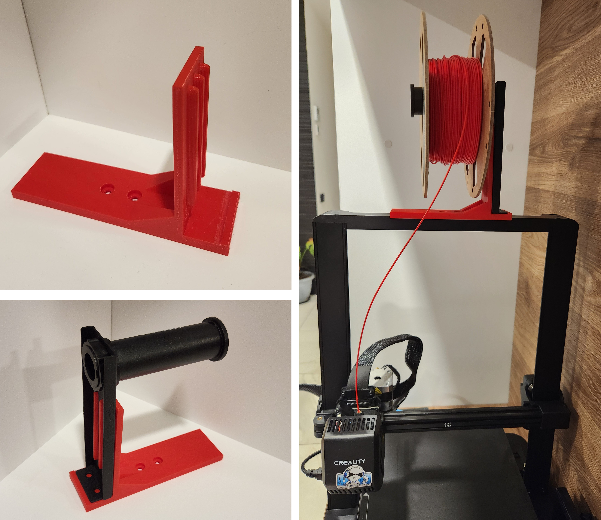

# Filament spool holder frame for Ender3 V3 SE

[![CC BY 4.0][cc-by-shield]][cc-by]

Balanced filament spool holder frame for Ender3 V3 SE.

The spool is rotated 90º, and moved so that the spool hangs
above the gantry in the middle of it, making
centre of the mass right at the center. It zeroes out
all possible torques caused by filament weight,
resulting into more consistent printing.

* Easy to print
* No additional screws needed
* Reinforced by using 3D-printer's original steel spool holder
* No support required
* 20% or more infill is recommended

Inspired by [Clslee Lee's](https://www.printables.com/@ClsleeLee_1097777) 
[model](https://www.printables.com/model/572862-ender-3-v3-se-spool-holder)
(although not a remix of it).

## License

This work is licensed under a
[Creative Commons Attribution 4.0 International License][cc-by].

[![CC BY 4.0][cc-by-image]][cc-by]

[cc-by]: http://creativecommons.org/licenses/by/4.0/
[cc-by-image]: https://i.creativecommons.org/l/by/4.0/88x31.png
[cc-by-shield]: https://img.shields.io/badge/License-CC%20BY%204.0-lightgrey.svg
